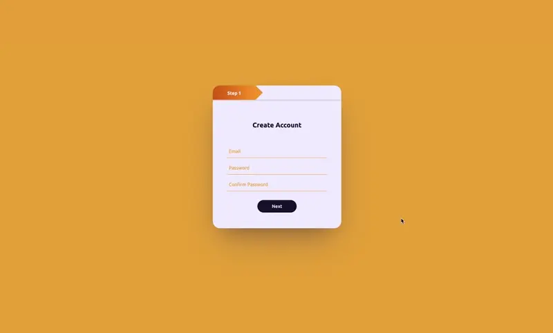

# Multi-Step Registration Form

## Description

This project is a multi-step registration form implemented in HTML, CSS, and JavaScript. It guides users through a three-step process to register for an account, collecting different types of information at each step.

## Key Features

- **Step-by-Step Process:** Guides users through the registration process in three steps.
- **Input Validation:** Validates user input to ensure data accuracy.
- **Progress Indicator:** Provides a visual indicator of the user's progress through the registration steps.
- **Easy Navigation:** Allows users to move forward and backward between steps seamlessly.

## Technologies Used

- **HTML:** Provides the structure of the registration form.
- **CSS:** Handles the styling and layout of the user interface.
- **JavaScript:** Implements the logic for step navigation and form validation.
